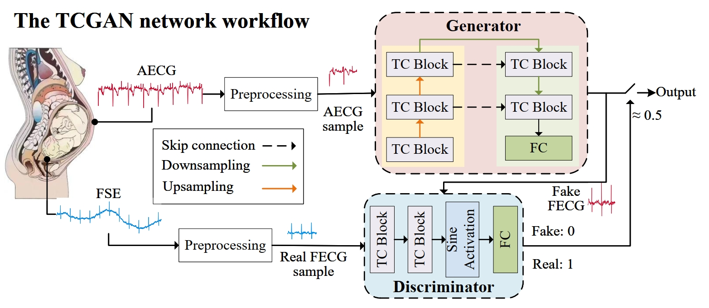
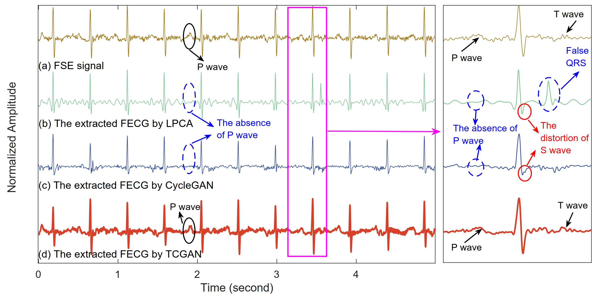

# TCGAN: Temporal Convolutional Generative Adversarial Network for Fetal ECG Extraction Using Single-channel Abdominal ECG

⭐ our [article](https://ieeexplore.ieee.org/document/10818591) ⭐ 

⭐ Our contributions are as follows:
- Novel Temporal Convolutional GAN for FECG Extraction: TCGAN introduces temporal convolution blocks, enhancing the model’s ability to capture both global and local ECG features, leading to more accurate FECG waveform reconstruction.
- Improved Waveform Detail Preservation via Encoder-Decoder and Skip Connections: The encoder-decoder architecture with skip connections enables effective merging of feature maps, improving the preservation of detailed waveform information during FECG extraction.
⭐ 



## Requirements

```python
pip install -r requirements.txt
```
## Folder Description
### 1.data
This includes preprocessing of the data and preparation of the dataset.
### 2.Dataset
It contains a classic non-invasive fetal ECG dataset: ADFECGDB.
### 3.options
This mainly includes training and testing parameters, such as learning rate, epochs and so on. If you want to adjust the training status, you should see this file.
### 4.Model.py
This is the code for the model: TCGAN.
### 5.Common_blocks
It contains the common blocks which are used in TCGAN.


## Train
```
python train.py
```
## Results



## Citation
If our code is helpful to you, please cite:

```
@article{r1,
  title={ TCGAN: Temporal Convolutional Generative Adversarial Network for Fetal ECG Extraction Using Single-channel Abdominal ECG},
  author={Zhen -Zhen Huang, Wei -Tao Zhang, Yang Li, Jian Cui and Ya -Ru Zhang},
  journal={ IEEE Journal of Biomedical and Health Informatics},
  year={2025},
  publisher={IEEE}
}
```

